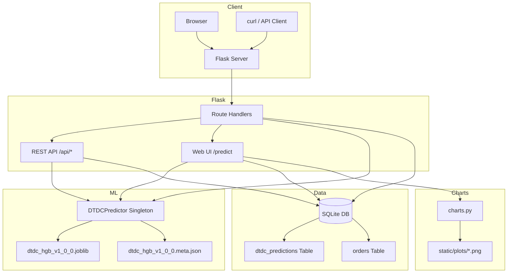

<div align="center">
  <h1>📦 SmartDelivery — ML-Powered Delivery Duration Predictor</h1>
  <p>
    <strong>End-to-end machine learning platform</strong> for predicting shipment delivery times across Indian cities.<br>
    Trained on 49,639 real DTDC courier records. Achieves <strong>MAE 0.54 days</strong> (≈13 hours) with a tuned HistGradientBoosting model.
  </p>
  <p>
    <a href="#-features">Features</a> •
    <a href="#-tech-stack">Tech Stack</a> •
    <a href="#-architecture">Architecture</a> •
    <a href="#-ml-pipeline">ML Pipeline</a> •
    <a href="#-installation">Installation</a> •
    <a href="#-api-docs">API Docs</a> •
    <a href="#-deployment">Deployment</a>
  </p>

  <p>
    
    
    
    
    
  </p>
</div>

---

## 🧠 The Problem

Indian logistics companies handle millions of shipments daily across a complex network of cities, each with different transit modes (Surface, Express, Air Cargo), varying parcel characteristics, and unpredictable delivery timelines. **Customers and businesses need accurate delivery estimates** to plan inventory, manage expectations, and optimize logistics operations.

This project builds a production-ready ML system that predicts delivery duration in **days** given origin, destination, shipment mode, parcel weight, and other booking-time features — trained on **49,639 real DTDC courier records**.

---

## ✨ Features

- **🔮 ML-Powered Predictions** — Tuned HistGradientBoostingRegressor achieving MAE of 0.54 days (≈13 hours)
- **🌐 REST API** — Clean JSON API (`POST /api/predict`) for easy integration into any logistics workflow
- **📊 Live Dashboard** — Real-time analytics with model KPIs (MAE, R²), prediction volume, mode impact charts, and route heatmaps
- **📝 Prediction Audit Log** — Every prediction is logged with full input parameters, predicted value, and model version
- **🎨 Modern Glassmorphic UI** — Dark/light theme, responsive design, interactive ambient scene, and professional typography
- **🏗️ Versioned Model Artifacts** — Semantic versioning for ML models with companion metadata (hyperparameters, metrics, training date)
- **🔒 Safe Unknown Categories** — OneHotEncoder with `handle_unknown="ignore"` gracefully handles unseen cities or modes

---

## 🚀 Live Demo

The application is deployed and running at:

**👉 [https://smart-delivery-prediction.onrender.com](https://smart-delivery-prediction.onrender.com)**

No login required. Open it in any browser and start making predictions immediately.

> ⚠️ **Note:** The free Render tier may take 30-60 seconds to spin up after periods of inactivity (cold start). Once loaded, subsequent requests are fast.

---

## 🛠️ Tech Stack

| Layer | Technology |
|---|---|
| **Frontend** | HTML5, CSS3 (Glassmorphism), JavaScript (ES6), Jinja2 templates |
| **Backend** | Python 3.10+, Flask 3.0 |
| **Machine Learning** | scikit-learn (HistGradientBoostingRegressor), pandas, NumPy |
| **Model Evaluation** | Cross-validation, Grid Search, permutation importance |
| **Database** | SQLite (production), with migration support |
| **Visualization** | Matplotlib (dark-theme charts) |
| **Serialization** | joblib (model artifacts), JSON (metadata) |
| **Deployment** | Render (via `render.yaml`), Gunicorn |
| **Testing** | pytest |
| **Design** | Inter font, CSS custom properties, dark/light theme |

---

## 🏗️ Architecture



---

## 🤖 ML Pipeline

### Dataset

- **Source**: DTDC Improved Dataset (49,639 real courier records)
- **Target**: `delivery_duration_days` — actual delivery time in days
- **Features**: 9 booking-time fields (no PII, no post-delivery data)

### Preprocessing

| Step | Description |
|---|---|
| Unicode normalisation | NFKC normalization of all category strings |
| Whitespace cleaning | Strip, collapse multiple spaces |
| Case folding | All categories lowercased for consistency |
| Validation | Reject missing/invalid weights, pieces, dates |
| Deduplication | Remove exact duplicate rows |
| Date extraction | Extract weekday name from booking date |

### Feature Engineering

| Feature | Type | Description |
|---|---|---|
| `origin` | Categorical | Origin city (32 Indian cities) |
| `destination` | Categorical | Destination city (32 Indian cities) |
| `booking_weekday` | Categorical | Day of week (Monday–Sunday) |
| `mode` | Categorical | Surface, Express, or Air Cargo |
| `nature_of_consignment` | Categorical | Dox (Documents) or Non-Dox (Parcel) |
| `total_pieces` | Numeric | Number of items in shipment |
| `actual_weight` | Numeric | Actual weight in kg |
| `volumetric_weight` | Numeric | Dimensional weight in kg |
| `chargeable_weight` | Numeric | Billing weight (max of actual & volumetric) |

Encoding: OneHotEncoder with `handle_unknown="ignore"` for categoricals.
Numerics: Passed through unchanged (tree-based model handles scale natively).

### Model Comparison

| Model | MAE (days) | RMSE (days) | R² | Training Time |
|---|---|---|---|---|
| **HistGradientBoostingRegressor** (tuned) | **0.5361** | **0.7263** | **0.7466** | 0.8s |
| HistGradientBoostingRegressor (baseline) | 0.5595 | 0.7324 | 0.7424 | 0.8s |
| RandomForestRegressor | 0.5793 | 0.7430 | 0.7349 | 14.1s |

*XGBoost was not available in the environment — evaluation was skipped.*

### Hyperparameter Tuning

A randomized search over **150 of 960** possible configurations with 5-fold cross-validation (750 fits).

**Search Space:**

| Parameter | Values Tested | Best Value |
|---|---|---|
| `learning_rate` | 0.01, 0.03, 0.05, 0.07, 0.10 | **0.03** |
| `max_iter` | 50, 100, 150, 200 | **150** |
| `max_depth` | None, 6, 8, 10 | **6** |
| `min_samples_leaf` | 20, 30, 50 | **20** |
| `l2_regularization` | 0.0, 0.01, 0.1, 1.0 | **0.0** |

### Final Model

**HistGradientBoostingRegressor** — selected for:
- Lowest holdout MAE (0.5361 days)
- Highest R² (0.7466)
- Near-perfect train/test balance (ratio 0.973)
- Fast inference (~5.8 µs per prediction)
- No overfitting (CV MAE std: ±0.0056)

### Feature Importance

| Feature | Importance |
|---|---|
| `mode_surface` | 0.649 |
| `total_pieces` | 0.207 |
| `nature_of_consignment_dox` | 0.173 |
| `actual_weight` | 0.121 |
| `nature_of_consignment_non-dox` | 0.024 |

**Key insight:** Surface mode dominates — ground transport vs express is the primary driver of delivery duration.

---

## 📈 Final Performance

| Metric | Value |
|---|---|
| **Holdout MAE** | 0.5361 days (~12.9 hours) |
| **Holdout RMSE** | 0.7263 days |
| **Holdout R²** | 0.7466 |
| **CV MAE (5-fold)** | 0.5306 ± 0.0056 days |
| **Training Time** | ~0.8s |
| **Inference Time** | ~5.8 µs / prediction |

---

## 📁 Folder Structure

```
smart-delivery-prediction/
├── app.py                      # Flask application & route handlers
├── dtdc_model.py               # Production DTDC model (training + prediction wrapper)
├── config.py                   # Configuration & environment variables
├── database.py                 # SQLite access layer
├── charts.py                   # Matplotlib chart generation for dashboard
├── ml_model.py                 # Legacy synthetic model (still used by dashboard)
├── seed_data.py                # Synthetic data generator (legacy)
├── train_model.py              # Legacy model training script
├── cli.py                      # Legacy CLI predictor
├── schema.sql                  # Database schema
├── requirements.txt            # Python dependencies
├── render.yaml                 # Render deployment config
├── .gitignore
├── pytest.ini
├── README.md
│
├── data/
│   ├── dtdc_preprocessing.py       # Data preprocessing pipeline
│   ├── dtdc_model_evaluation.py    # Candidate model evaluation framework
│   └── migrate_dtdc.py             # DTDC CSV → DB migration (legacy)
│
├── models/
│   ├── dtdc_hgb_v1_0_0.joblib      # Production model artifact (564 KB)
│   ├── dtdc_hgb_v1_0_0.meta.json   # Production model metadata
│   └── .gitkeep
│
├── static/
│   ├── css/app.css                  # Design system (glassmorphism, tokens)
│   ├── js/scene.js                  # Animated ambient scene
│   └── plots/                       # Generated chart images
│
├── templates/
│   ├── base.html                    # Layout (navbar, footer, theme)
│   ├── index.html                   # Prediction form
│   ├── result.html                  # Prediction result
│   ├── dashboard.html               # Analytics dashboard
│   └── admin.html                   # Database explorer
│
├── tests/
│   └── test_delivery.py             # Integration tests
│
└── utils/                          # (removed in cleanup)                         # (empty — removed in cleanup)
```

---

## 📦 Installation

### Prerequisites

- Python 3.10 or higher
- pip
- Git

### Step-by-Step Setup

```bash
# 1. Clone the repository
git clone https://github.com/suman2308/Delivery-time-prediction.git
cd Delivery-time-prediction

# 2. Create and activate a virtual environment
python -m venv .venv

# Windows (PowerShell)
.\.venv\Scripts\Activate.ps1

# macOS / Linux
source .venv/bin/activate

# 3. Install dependencies
pip install -r requirements.txt

# 4. (Optional) Train the DTDC model on fresh data
python -m dtdc_model train

# 5. Run the application
python app.py
```

Open `http://127.0.0.1:5000` in your browser.

---

## 🔧 Environment Variables

| Variable | Default | Description |
|---|---|---|
| `PORT` | `5000` | Server port |
| `FLASK_DEBUG` | `0` | Enable Flask debug mode (`1` to enable) |
| `BOOTSTRAP_ON_START` | `1` | Run legacy bootstrap on startup |
| `DELIVERY_DB_PATH` | `delivery.db` | SQLite database path |
| `DELIVERY_MODEL_PATH` | `models/delivery_regressor.joblib` | *(Legacy)* Old model path |

> The DTDC model path is managed internally by `dtdc_model.py` and is not configurable via environment variables.

---

## 🖥️ Running Locally

```bash
# Start the Flask development server
python app.py

# Or with Gunicorn (recommended for production)
gunicorn app:app --bind 0.0.0.0:5000 --workers 2 --timeout 120
```

### CLI Usage

```bash
# Train the DTDC model
python -m dtdc_model train

# Interactive prediction via CLI
python -m dtdc_model predict

# Batch prediction via JSON lines
echo '{"origin":"Mumbai","destination":"Pune","booking_weekday":"Monday","mode":"Surface","nature_of_consignment":"Dox","total_pieces":1,"actual_weight":0.5,"volumetric_weight":0.8,"chargeable_weight":0.5}' | python -m dtdc_model predict
```

### Running Tests

```bash
pytest
```

---

## ☁️ Deployment on Render

1. Push the repository to GitHub:

```bash
git add .
git commit -m "Ready for deployment"
git push origin main
```

2. In [Render Dashboard](https://dashboard.render.com), click **New +** → **Blueprint**.

3. Select this repository.

4. Render automatically detects `render.yaml` and deploys with:
   - Build: `pip install -r requirements.txt`
   - Start: `gunicorn app:app --bind 0.0.0.0:$PORT --workers 2 --timeout 120`

5. Your app will be live at `https://smart-delivery-prediction.onrender.com`.

> ⚠️ **Important**: The DTDC model artifact (`models/dtdc_hgb_v1_0_0.joblib`) is included in the git repository and will be available after deployment. No additional setup is required.

---

## 📡 API Documentation

### `POST /api/predict`

Predict delivery duration in days.

**Request:**

```bash
curl -X POST http://127.0.0.1:5000/api/predict \
  -H "Content-Type: application/json" \
  -d '{
    "origin": "Mumbai",
    "destination": "Pune",
    "booking_weekday": "Monday",
    "mode": "Surface",
    "nature_of_consignment": "Dox",
    "total_pieces": 1,
    "actual_weight": 0.5,
    "volumetric_weight": 0.8,
    "chargeable_weight": 0.5
  }'
```

**Response:**

```json
{
  "predicted_time_days": 3.8444,
  "model_version": "1.0.0",
  "algorithm": "HistGradientBoostingRegressor"
}
```

**Error Response (400):**

```json
{
  "error": "origin is required."
}
```

### `GET /health`

```json
{ "status": "healthy" }
```

### `GET /metrics`

```json
{
  "mae_days": 0.5361,
  "rmse_days": 0.7263,
  "r2": 0.7466,
  "model_version": "1.0.0",
  "algorithm": "HistGradientBoostingRegressor",
  "training_date": "2026-07-30T04:29:48.595917+00:00"
}
```

---

## 🔮 Future Improvements

- [ ] **Geographic clustering** — Group origin/destination cities by region to improve generalization for unseen routes
- [ ] **Real-time features** — Integrate weather API and traffic data for live-adjusted predictions
- [ ] **SHAP explanations** — Add per-prediction feature importance for explainability
- [ ] **Automated retraining** — CI/CD pipeline that retrains on new data and hot-swaps model artifacts
- [ ] **Interactive charts** — Replace static Matplotlib PNGs with interactive Plotly/D3.js visualizations
- [x] **Docker support** — Containerize the application with Docker for consistent deployments (Dockerfile + docker-compose.yml included)
- [ ] **CI/CD pipeline** — Automated testing with GitHub Actions on every push
- [ ] **User authentication** — Add API keys and rate limiting for production use
- [ ] **Expanded test coverage** — Add unit tests for `dtdc_model.py` and edge cases

---

## 📄 License

Distributed under the **MIT License**. See `LICENSE` for more information.

---

<div align="center">
  <sub>Built with ❤️ using Python, Flask, scikit-learn & modern CSS</sub>
  <br>
  <sub>© 2026 Suman Jash</sub>
</div>
